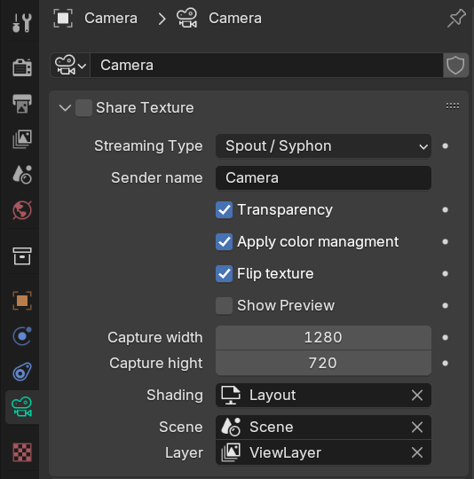
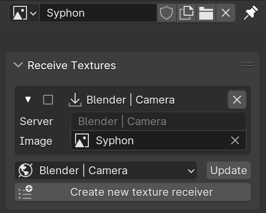

# Texture sharing addon V6.1.2 for Blender 3.x upwards

Blender addon that allows to share textures via [Spout](http://spout.zeal.co/) or [Syphon](https://syphon.github.io/) or [NDI](https://ndi.video) from and to blender.

This works for current Windows (Spout & NDI), Linux (NDI) and OSX (Syphon & NDI).

⚠️ This library is still *in development*.

## State of Development

### OSX
- [x] OSX Syphon Metal Server
- [x] OSX Syphon OpenGL Server
- [x] OSX Syphon Server Discovery
- [x] OSX Syphon Metal Client (blender 4.x upwards) 
- [ ] OSX Syphon OpenGL Client

### Windows

- [x] Windows Spout Sender
- [x] Windows Spout Sender Discovery (only supported from spout version 0.1.0 onward)
- [x] Windows Spout Receiver (only supported from spout version 0.1.0 onward)

⚠️ If you have already used this addon before - please reinstall the spout python package to get to version 0.1.0 ⚠️

### Linux, Windows, OSX

- [x] NDI Sender
- [x] NDI Sender Discovery
- [x] NDI Receiver

## Installation

### Requirements

If you want to use NDI, donwload and install [NDI SDK](https://ndi.video/download-ndi-sdk/) before you continue intalling the addon.

You also need to download manually the wheel files for your system. 

The wheels for Windows and OSX can be found [here](https://github.com/maybites/TextureSharing/releases/tag/V6.0.0). A Linux variant is available from [here](https://github.com/buresu/ndi-python/issues/31#issuecomment-1551186707) - this is untested, though. All other Linux users have to [build a wheel themself](https://github.com/buresu/ndi-python#build).

### Steps

Please make sure you have the most current Blender installed.

1. [Download](https://github.com/maybites/TextureSharing/releases) the addon from the **releases**

2. Open Blender > Menu >  Preferences > Add-ons > search for and enable the 'TextureSharing' add-on  

3. If available, press the button to install the SpoutGL or syphon-python library via pip.

4. For NDI locate the downloaded wheel file for your system architecture.

5. Press the button to install the NDI library .

6. Once the library is installed, disable and reenable the addon.

7. Save and close preferences.

## Usage

See the current limitation above under **State of Development**

### Sharing Textures

For sharing you need a **Camera** object.

The plugin adds a panel to the **Camera** properties called 'Share texture'. The following properties are available:

* The streaming type (NDI, Spout or Syphon)
* The sender (also known as syphon-server) name is default set to the camera name.
* use color management (recommended).
* vertical flip of the output texture.
* show preview inside viewport.
* capture/streaming resolution.
* chose a workspace with the desired render / shading preferences.
* chose a scene and layer setup to render.

You should be able to create as many **Cameras** and share textures as you wish.

### Receiving Shared Textures

The plugin adds a panel to the UV-Editor Tools 'Share texture'.

* create a new image and name it accordingly (in the above case 'Syphon')
* press update to get all available shared textures.
* select a sender/server
* press 'create'
* select the image inside the pane.
* enable the receiver

The receiver will automatically adjust the image size to the size of the received texture. 

Caveat: With the current implementation the update speed is very low (a few frames a second). 
Thats because the received texture needs to be copied from the GPU into an image buffer on the CPU.
For the time beeing I dont see another way to solve this.

## Issues

When uninstalling a package, blender needs to be restarted to reflect the missing package in the userinterface.

## Credits

Blender Plugin by Martin Froehlich.

### Special Thanks:

* Lyn Jarvis for developing [Spout](http://spout.zeal.co/)
* Tom Butterworth and Anton Marini for developing [Syphon](https://syphon.github.io/)
* Jason for the python wrappper [SpoutGL for Python](https://github.com/jlai/Python-SpoutGL) 
* Florian Bruggisser for the python wrappper [syphon-python](https://github.com/cansik/syphon-python)
* Without the valuable [hint](https://docs.blender.org/api/master/gpu.html#rendering-the-3d-view-into-a-texture) from Jonas Dichelle I would still dab in darkness...
* [CAD_Sketcher](https://github.com/hlorus/CAD_Sketcher) showed me how to dynamically install the needed libraries. Hurray to Opensource!

### Very Special Thanks

* Python support by Florian Bruggisser - without him, the flawless working of spyhon in blender would still be a dream.
* Spout Directory/Receiver implemented by Jonathan Chemla 
