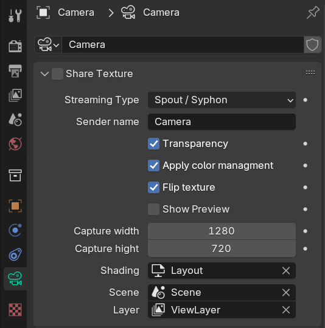
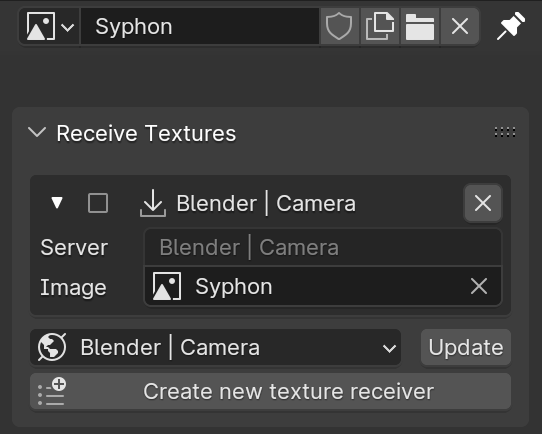

# Texture sharing addon for Blender 5.x upwards

[](https://github.com/maybites/TextureSharing/releases/latest)

Blender addon that allows to share textures via [Spout](http://spout.zeal.co/) or [Syphon](https://syphon.github.io/) or [NDI](https://ndi.video) from and to blender.

This works for current Windows (Spout & NDI), Linux (NDI) and OSX (Syphon & NDI).

## State of Development

### OSX

- ✅ OSX Syphon Metal Server
- ✅ OSX Syphon OpenGL Server
- ✅ OSX Syphon Server Discovery
- ⚠️ OSX Syphon Metal Client (blender 4.x upwards) 
- ❌ OSX Syphon OpenGL Client (Intel Macs)

### Windows

- ✅ Windows Spout Sender
- ✅ Windows Spout Sender Discovery 
- ⚠️ Windows Spout Receiver 

### Linux, Windows, OSX

- ✅ NDI Sender
- ✅ NDI Sender Discovery
- ⚠️ NDI Receiver

---

✅ = Works | ⚠️ = Performance issues. See below. | ❌ = not implemented.

## Installation

Please make sure you have the most current Blender installed.

1. Download the latest release zip from the [**Releases** page](https://github.com/maybites/TextureSharing/releases/latest) (`TextureSharing-vX.Y.Z.zip`).
   (Alternatively, the bleeding-edge [master as a zip](https://github.com/maybites/TextureSharing/archive/refs/heads/master.zip) — note this is unpackaged source, not a release build.)

2. In Blender > Menu > Preferences > Add-ons > install the downloaded zip via *Install from Disk*, then search for and enable the 'TextureSharing' add-on.

3. Press the button to install the NDI library .

4. If available, press the button to install the SpoutGL or syphon-python library via pip.

5. Once the library is installed, disable and reenable the addon.

6. If the addon doesn't show a successfully loaded python-library, then try restarting blender.

7. Save and close preferences.

## Usage

See the current limitation above under **State of Development**

### Sharing Textures

For sharing you need a **Camera** object.

The plugin adds a panel to the **Camera** properties called 'Share texture'. The following properties are available:



* The streaming type (NDI, Spout or Syphon)
* The sender (also known as server) name is default set to the camera name.
* use color management (recommended).
* render transparent background. (⚠️ seems to work only for 'Display in solid mode')
* vertical flip of the output texture.
* show preview inside viewport.
* capture/streaming resolution.
* chose a workspace with the desired render / shading preferences.
* chose a scene and layer setup to render.

You should be able to create as many **Cameras** and share textures as you wish.

### Receiving Shared Textures

The plugin adds a panel to the UV-Editor Tools 'Share texture'.



* create a new image and name it accordingly (in the above case 'Spout')
* press update to get all available shared textures.
* select a sender/server
* press 'create'
* select the image inside the pane.
* enable the receiver

The receiver will automatically adjust the image size to the size of the received texture. 

## Issues

### Receiver

With the current implementation the update speed is very low (a few frames a second). 
Thats because the received texture needs to be copied into an image buffer on the CPU.

-> https://docs.blender.org/api/current/bpy.types.Image.html#bpy.types.Image.pixels

If anybody knows a more efficient way to do this, please let me know.

### deinstallation

When desinstalling a package, blender needs to be restarted to reflect the missing package in the userinterface.

## Releasing a new version

Releases are built automatically by GitHub Actions when a version tag is pushed. To cut a release:

1. Bump `bl_info["version"]` in `__init__.py`, e.g. `"version": (9, 1, 0)`.
2. Commit the change:

   ```bash
   git commit -am "Release v9.1.0"
   ```

3. Tag with a matching `vMAJOR.MINOR.PATCH` tag and push:

   ```bash
   git tag v9.1.0
   git push origin master --tags
   ```

The workflow verifies the tag matches `bl_info["version"]` (and fails otherwise), packages the addon as `TextureSharing-vX.Y.Z.zip`, and publishes it on the [Releases page](https://github.com/maybites/TextureSharing/releases) with auto-generated release notes.

## Credits

Blender Plugin by Martin Froehlich.

### Special Thanks:

* Lyn Jarvis for developing [Spout](http://spout.zeal.co/)
* Tom Butterworth and Anton Marini for developing [Syphon](https://syphon.github.io/)
* Jason for the python wrappper [SpoutGL for Python](https://github.com/jlai/Python-SpoutGL) 
* Florian Bruggisser for the python wrappper [syphon-python](https://github.com/cansik/syphon-python)
* Without the valuable [hint](https://docs.blender.org/api/master/gpu.html#rendering-the-3d-view-into-a-texture) from Jonas Dichelle I would still dab in darkness...
* [CAD_Sketcher](https://github.com/hlorus/CAD_Sketcher) showed me how to dynamically install the needed libraries. Hurray to Opensource!

### Very Special Thanks

* Python support by Florian Bruggisser - without him, the flawless working of spyhon in blender would still be a dream.
* Spout Directory/Receiver implemented by Jonathan Chemla 
